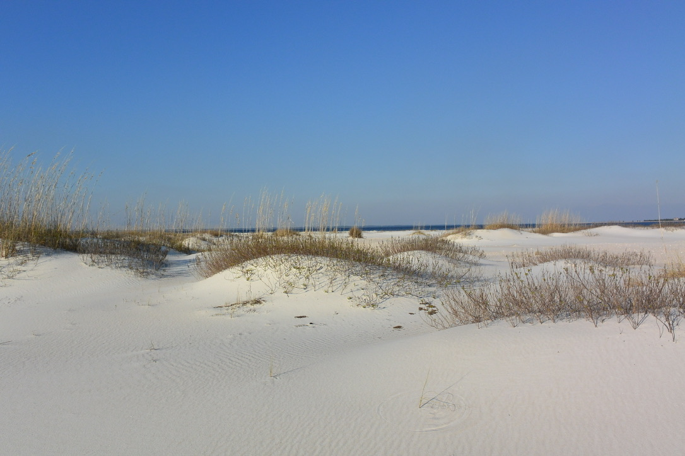
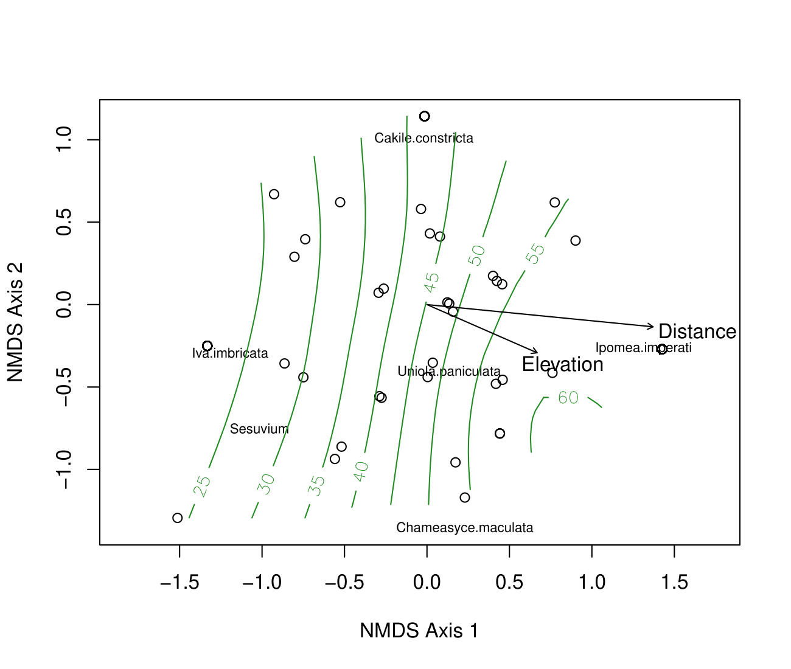
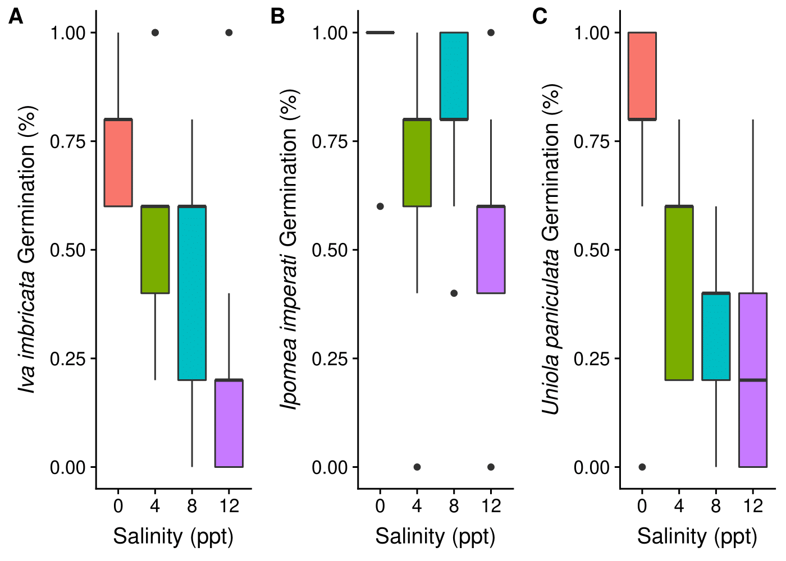
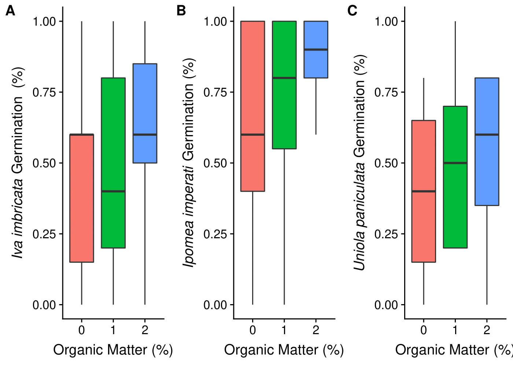

# Coastal Dunes Plant Ecology and Germination Project

Title: Germination Traits Explain Deterministic Processes in the Assembly of Early Successional Coastal Dune Vegetation

Author: Matthew D. Green and Thomas E. Miller

Article Link: https://link.springer.com/article/10.1007%2Fs12237-019-00550-0

## Photo of Sand Dune Ecosystem on St.George Island, FL

# Results

## Plant Species Disitbutions are stuctred by distance from the ocean and elevation

#### Figure 1:

## Plant Species Germianition Traits Explain Species Distibutions

#### Figure 2: 

### Figure 3:

